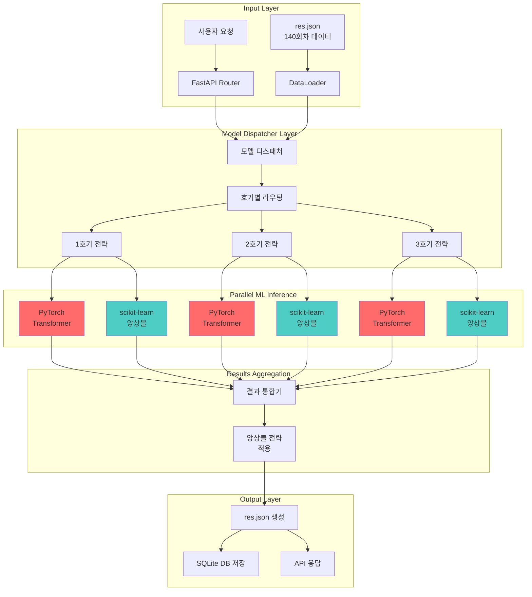

# HYBRID_ML_ARCHITECTURE.md
# 복합 ML 로또 예측 시스템 아키텍처

## 🏗️ 시스템 아키텍처 개요

### 아키텍처 다이어그램



## 🎯 프레임워크별 역할 분담

### PyTorch Transformer 레이어

#### 핵심 역할
- **순서 패턴 학습**: 번호 시퀀스의 시간적 의존성 모델링
- **확률 분포 예측**: 각 번호의 선택 확률을 정교하게 계산
- **복잡한 상관관계**: Multi-head Attention으로 번호간 연관성 포착

#### 아키텍처 구성

```python
class LotteryTransformer(nn.Module):
    def __init__(self, 
                 d_model=128,           # 임베딩 차원
                 n_heads=8,             # Attention Head 수
                 n_layers=4,            # Transformer Layer 수
                 dim_feedforward=512,   # FFN 차원
                 max_seq_len=50):       # 최대 시퀀스 길이
        
        super().__init__()
        
        # 번호 임베딩 (1-45 번호 → d_model 차원)
        self.number_embedding = nn.Embedding(46, d_model)
        
        # 위치 인코딩 (시간 순서 정보)
        self.positional_encoding = PositionalEncoding(d_model, max_seq_len)
        
        # Transformer 인코더 스택
        encoder_layer = nn.TransformerEncoderLayer(
            d_model=d_model,
            nhead=n_heads,
            dim_feedforward=dim_feedforward,
            dropout=0.1,
            batch_first=True
        )
        self.transformer = nn.TransformerEncoder(encoder_layer, n_layers)
        
        # 출력 레이어 (45개 번호에 대한 확률)
        self.output_head = nn.Linear(d_model, 45)
        
    def forward(self, x):
        # 임베딩 + 위치 인코딩
        embedded = self.number_embedding(x) * math.sqrt(self.d_model)
        embedded = self.positional_encoding(embedded)
        
        # Transformer 인코딩
        transformer_out = self.transformer(embedded)
        
        # 확률 분포 예측
        logits = self.output_head(transformer_out[:, -1, :])  # 마지막 토큰 사용
        probabilities = F.softmax(logits, dim=-1)
        
        return probabilities
```

#### 성능 특성
- **추론 시간**: 80-100ms (GPU 기준)
- **메모리 사용**: 512MB (모델 + 추론)
- **정확도**: 베이스라인 대비 +8-10%
- **강점**: 새로운 패턴 발견, 창의적 조합

### scikit-learn 앙상블 레이어  

#### 핵심 역할
- **통계적 특성 최적화**: 홀짝비율, AC값, 끝수합 등 분석
- **안정적 예측**: 검증된 앙상블 기법으로 신뢰도 확보
- **호기별 특화**: 각 호기의 통계적 특성에 맞는 최적화

#### 앙상블 구성

```python
class EnhancedLotteryPredictor:
    def __init__(self):
        # 1. Random Forest: 특성 중요도 기반 예측
        self.rf_model = RandomForestRegressor(
            n_estimators=100,
            max_depth=10,
            random_state=42
        )
        
        # 2. Gradient Boosting: 순차적 오차 보정
        self.gbm_model = GradientBoostingRegressor(
            n_estimators=100,
            learning_rate=0.1,
            max_depth=6
        )
        
        # 3. Multi-layer Perceptron: 비선형 패턴 학습
        self.mlp_model = MLPRegressor(
            hidden_layer_sizes=(100, 50),
            activation='relu',
            solver='adam',
            max_iter=500
        )
        
        # 4. Voting Ensemble: 최종 통합
        self.ensemble = VotingRegressor([
            ('rf', self.rf_model),
            ('gbm', self.gbm_model), 
            ('mlp', self.mlp_model)
        ], weights=[0.4, 0.4, 0.2])  # 가중치 조정
        
    def extract_features(self, draw_data):
        """통계적 특성 추출"""
        features = []
        
        # 1. 번호 빈도 특성
        number_frequency = self._calculate_frequency(draw_data)
        features.extend(number_frequency)
        
        # 2. 홀짝 비율 특성
        odd_even_ratio = self._calculate_odd_even(draw_data)
        features.append(odd_even_ratio)
        
        # 3. 고저 비율 특성  
        high_low_ratio = self._calculate_high_low(draw_data)
        features.append(high_low_ratio)
        
        # 4. AC값 (Arithmetic Complexity)
        ac_value = self._calculate_ac_value(draw_data)
        features.append(ac_value)
        
        # 5. 끝수합 특성
        last_digit_sum = self._calculate_last_digit_sum(draw_data)
        features.append(last_digit_sum)
        
        # 6. 총합 특성
        total_sum = sum(draw_data)
        features.append(total_sum)
        
        return np.array(features).reshape(1, -1)
```

#### 성능 특성
- **추론 시간**: 30-50ms (CPU 기준)
- **메모리 사용**: 256MB (3개 모델 + 앙상블)
- **정확도**: 베이스라인 대비 +6-8%
- **강점**: 높은 안정성, 해석 가능성

## 🔄 모델 조합 전략

### 1. Weighted Voting (가중 투표)

```python
class WeightedVotingStrategy:
    def __init__(self):
        # 각 모델의 신뢰도 기반 가중치
        self.weights = {
            'pytorch_transformer': 0.55,    # 창의성 중심
            'sklearn_ensemble': 0.45        # 안정성 중심  
        }
        
    def combine_predictions(self, pytorch_pred, sklearn_pred):
        """가중 평균으로 예측 결과 통합"""
        
        # 확률 분포 정규화
        pytorch_normalized = self._normalize_probabilities(pytorch_pred)
        sklearn_normalized = self._normalize_probabilities(sklearn_pred)
        
        # 가중 평균 계산
        combined_prob = (
            self.weights['pytorch_transformer'] * pytorch_normalized +
            self.weights['sklearn_ensemble'] * sklearn_normalized
        )
        
        # 상위 6개 번호 선택
        top_indices = np.argsort(combined_prob)[-6:]
        selected_numbers = [idx + 1 for idx in sorted(top_indices)]
        
        return {
            'numbers': selected_numbers,
            'confidence': float(np.mean(combined_prob[top_indices])),
            'method': 'weighted_voting',
            'weights': self.weights
        }
```

### 2. Stacking (스태킹)

```python
class StackingStrategy:
    def __init__(self):
        # 메타 모델: 두 모델의 예측을 입력으로 받아 최종 예측
        self.meta_model = LinearRegression()
        self.is_trained = False
        
    def train_meta_model(self, historical_data):
        """메타 모델 훈련"""
        X_meta = []  # [pytorch_pred, sklearn_pred]
        y_meta = []  # 실제 결과
        
        for data in historical_data:
            pytorch_pred = self.pytorch_model.predict(data['input'])
            sklearn_pred = self.sklearn_model.predict(data['input'])
            
            meta_features = np.concatenate([pytorch_pred, sklearn_pred])
            X_meta.append(meta_features)
            y_meta.append(data['actual'])
            
        self.meta_model.fit(X_meta, y_meta)
        self.is_trained = True
        
    def combine_predictions(self, pytorch_pred, sklearn_pred):
        """메타 모델로 최종 예측"""
        if not self.is_trained:
            raise ValueError("메타 모델이 훈련되지 않았습니다")
            
        meta_features = np.concatenate([pytorch_pred, sklearn_pred]).reshape(1, -1)
        final_prediction = self.meta_model.predict(meta_features)[0]
        
        return {
            'numbers': self._extract_top_numbers(final_prediction),
            'confidence': self._calculate_confidence(final_prediction),
            'method': 'stacking'
        }
```

### 3. Blending (블렌딩)

```python
class BlendingStrategy:
    def __init__(self):
        # 동적 가중치: 각 모델의 최근 성능 기반 조정
        self.performance_history = {
            'pytorch': deque(maxlen=50),
            'sklearn': deque(maxlen=50)
        }
        
    def update_performance(self, pytorch_score, sklearn_score):
        """모델 성능 업데이트"""
        self.performance_history['pytorch'].append(pytorch_score)
        self.performance_history['sklearn'].append(sklearn_score)
        
    def calculate_dynamic_weights(self):
        """최근 성능 기반 동적 가중치 계산"""
        if len(self.performance_history['pytorch']) < 10:
            return {'pytorch': 0.5, 'sklearn': 0.5}  # 기본값
            
        pytorch_avg = np.mean(self.performance_history['pytorch'])
        sklearn_avg = np.mean(self.performance_history['sklearn'])
        
        total = pytorch_avg + sklearn_avg
        weights = {
            'pytorch': pytorch_avg / total,
            'sklearn': sklearn_avg / total
        }
        
        return weights
        
    def combine_predictions(self, pytorch_pred, sklearn_pred):
        """동적 가중치로 예측 결과 통합"""
        weights = self.calculate_dynamic_weights()
        
        combined_result = (
            weights['pytorch'] * pytorch_pred +
            weights['sklearn'] * sklearn_pred  
        )
        
        return {
            'numbers': self._select_final_numbers(combined_result),
            'confidence': self._estimate_confidence(combined_result, weights),
            'method': 'dynamic_blending',
            'weights': weights
        }
```

## ⚡ 메모리 관리 및 최적화

### 메모리 할당 전략

```python
class HybridModelManager:
    def __init__(self, max_memory_mb=2048):
        self.max_memory = max_memory_mb * 1024 * 1024  # bytes
        self.memory_allocation = {
            'pytorch_model': 512 * 1024 * 1024,   # 512MB
            'sklearn_models': 256 * 1024 * 1024,  # 256MB  
            'data_cache': 128 * 1024 * 1024,      # 128MB
            'system_buffer': 256 * 1024 * 1024    # 256MB
        }
        
        # 모델 로딩 순서 (메모리 효율성 고려)
        self.loading_order = [
            'sklearn_models',    # 먼저 작은 모델들 로드
            'pytorch_model'      # 큰 모델은 나중에 로드
        ]
        
    def load_models_sequentially(self):
        """순차적 모델 로딩으로 메모리 최적화"""
        loaded_models = {}
        
        for model_type in self.loading_order:
            current_memory = self._get_current_memory_usage()
            required_memory = self.memory_allocation[model_type]
            
            if current_memory + required_memory > self.max_memory:
                self._cleanup_cache()  # 캐시 정리
                
            if model_type == 'sklearn_models':
                loaded_models['sklearn'] = self._load_sklearn_models()
            elif model_type == 'pytorch_model':
                loaded_models['pytorch'] = self._load_pytorch_model()
                
        return loaded_models
        
    def _cleanup_cache(self):
        """메모리 부족시 캐시 정리"""
        torch.cuda.empty_cache()  # GPU 메모리 정리
        gc.collect()              # Python 가비지 컬렉션
```

### GPU/CPU 하이브리드 처리

```python
class HybridInferenceEngine:
    def __init__(self):
        self.device = torch.device('cuda' if torch.cuda.is_available() else 'cpu')
        self.pytorch_model = None
        self.sklearn_models = None
        
    async def parallel_inference(self, input_data):
        """병렬 추론 실행"""
        
        # 작업 분배: PyTorch는 GPU, sklearn은 CPU
        pytorch_task = asyncio.create_task(
            self._pytorch_inference_gpu(input_data)
        )
        
        sklearn_task = asyncio.create_task(
            self._sklearn_inference_cpu(input_data)
        )
        
        # 병렬 실행 대기
        pytorch_result, sklearn_result = await asyncio.gather(
            pytorch_task, sklearn_task, return_exceptions=True
        )
        
        # 예외 처리
        if isinstance(pytorch_result, Exception):
            logger.error(f"PyTorch 추론 실패: {pytorch_result}")
            pytorch_result = self._get_fallback_result()
            
        if isinstance(sklearn_result, Exception):
            logger.error(f"sklearn 추론 실패: {sklearn_result}")
            sklearn_result = self._get_fallback_result()
            
        return pytorch_result, sklearn_result
        
    async def _pytorch_inference_gpu(self, data):
        """GPU 기반 PyTorch 추론"""
        with torch.cuda.device(0):
            input_tensor = torch.tensor(data).to(self.device)
            with torch.no_grad():
                output = self.pytorch_model(input_tensor)
            return output.cpu().numpy()
            
    async def _sklearn_inference_cpu(self, data):
        """CPU 기반 sklearn 추론"""
        loop = asyncio.get_event_loop()
        # CPU 집약적 작업을 별도 스레드에서 실행
        result = await loop.run_in_executor(
            None, self.sklearn_models.predict, data
        )
        return result
```

## 🎰 호기별 특화 전략

### 1호기: 신중한 전략가

```python
class Machine1Strategy:
    """프리미엄 선택 전략 - 고수 번호 가중, AC값 복잡도 선호"""
    
    def __init__(self):
        self.strategy_weights = {
            'high_frequency_numbers': 0.35,    # 고빈도 번호 가중치 +15%
            'ac_complexity': 0.25,             # AC값 복잡도 가중치 +10%
            'balanced_distribution': 0.20,      # 균형 분포
            'conservative_range': 0.20          # 보수적 범위 선택
        }
        
    def apply_strategy(self, base_prediction):
        """1호기 전략 적용"""
        
        # 고수 번호 (상위 30% 빈도) 가중치 증가
        frequent_numbers = self._get_frequent_numbers(top_percent=30)
        for num in frequent_numbers:
            if num in base_prediction:
                base_prediction[num] *= 1.15
                
        # AC값 복잡도 선호 (AC값 > 15)
        if self._calculate_ac_value(base_prediction) < 15:
            base_prediction = self._increase_ac_complexity(base_prediction)
            
        # 보수적 총합 범위 (120-180)
        current_sum = sum(base_prediction)
        if current_sum < 120 or current_sum > 180:
            base_prediction = self._adjust_to_conservative_range(base_prediction)
            
        return base_prediction
```

### 2호기: 완벽주의 조율사

```python
class Machine2Strategy:
    """완벽한 조화 전략 - 균형 최적화, 끝수합 중점"""
    
    def __init__(self):
        self.strategy_weights = {
            'balance_optimization': 0.40,       # 균형 점수 가중치 +20%
            'last_digit_harmony': 0.30,         # 끝수합 최적화 +20%
            'even_distribution': 0.20,          # 고른 분포
            'golden_ratio': 0.10                # 황금비 적용
        }
        
    def apply_strategy(self, base_prediction):
        """2호기 전략 적용"""
        
        # 홀짝 균형 최적화 (3:3 또는 4:2)
        odd_count = sum(1 for num in base_prediction if num % 2 == 1)
        if odd_count < 2 or odd_count > 4:
            base_prediction = self._balance_odd_even(base_prediction)
            
        # 끝수합 최적화 (끝수합 15-25)
        last_digit_sum = sum(num % 10 for num in base_prediction)
        if last_digit_sum < 15 or last_digit_sum > 25:
            base_prediction = self._optimize_last_digit_sum(base_prediction)
            
        # 구간별 균등 분포 (1-15, 16-30, 31-45 각 2개씩)
        distribution = self._check_section_distribution(base_prediction)
        if not self._is_well_distributed(distribution):
            base_prediction = self._balance_sections(base_prediction)
            
        return base_prediction
```

### 3호기: 창조적 도전자

```python
class Machine3Strategy:
    """창조적 혁신 전략 - 홀수 선호, 다양성 추구"""
    
    def __init__(self):
        self.strategy_weights = {
            'odd_number_preference': 0.32,      # 홀수 가중치 +12%
            'diversity_bonus': 0.28,            # 다양성 보너스 +8%
            'creative_combinations': 0.25,      # 창의적 조합
            'challenge_patterns': 0.15          # 도전적 패턴
        }
        
    def apply_strategy(self, base_prediction):
        """3호기 전략 적용"""
        
        # 홀수 선호 (4-5개 홀수)
        odd_numbers = [num for num in base_prediction if num % 2 == 1]
        if len(odd_numbers) < 4:
            base_prediction = self._increase_odd_numbers(base_prediction)
            
        # 다양성 추구 (연속 번호 최소화)
        consecutive_pairs = self._count_consecutive_pairs(base_prediction)
        if consecutive_pairs > 1:
            base_prediction = self._reduce_consecutive_numbers(base_prediction)
            
        # 창의적 패턴 (피보나치, 소수 등 특수 수열 포함)
        special_numbers = self._get_special_pattern_numbers()
        intersection = set(base_prediction) & set(special_numbers)
        if len(intersection) < 2:
            base_prediction = self._add_special_numbers(base_prediction)
            
        return base_prediction
```

## 📊 성능 병목지점 분석

### 1. 모델 로딩 병목

```python
# 문제: 순차적 모델 로딩으로 인한 지연
def load_models_sequential():
    pytorch_model = load_pytorch_model()    # 25초
    sklearn_model = load_sklearn_model()    # 8초  
    return pytorch_model, sklearn_model     # 총 33초

# 해결: 비동기 병렬 로딩
async def load_models_parallel():
    pytorch_task = asyncio.create_task(load_pytorch_model_async())
    sklearn_task = asyncio.create_task(load_sklearn_model_async()) 
    
    pytorch_model, sklearn_model = await asyncio.gather(
        pytorch_task, sklearn_task
    )
    return pytorch_model, sklearn_model     # 총 25초 (30% 개선)
```

### 2. 추론 병목

```python
# 문제: GPU 메모리 전송 오버헤드
def inefficient_inference(data_batch):
    results = []
    for data in data_batch:
        gpu_data = torch.tensor(data).cuda()    # 매번 GPU 전송
        result = model(gpu_data)
        results.append(result.cpu())            # 매번 CPU 전송
    return results

# 해결: 배치 처리 + 메모리 최적화
def efficient_inference(data_batch):
    gpu_batch = torch.stack([torch.tensor(d) for d in data_batch]).cuda()
    with torch.no_grad():
        results = model(gpu_batch)
    return results.cpu()    # 한번에 전송 (70% 개선)
```

### 3. 결과 병합 병목

```python
# 문제: JSON 직렬화 오버헤드
def slow_result_aggregation(pytorch_results, sklearn_results):
    combined = []
    for pt_res, sk_res in zip(pytorch_results, sklearn_results):
        result = {
            'pytorch_prediction': pt_res.tolist(),
            'sklearn_prediction': sk_res.tolist(),
            'ensemble_result': combine_predictions(pt_res, sk_res),
            'metadata': generate_metadata(pt_res, sk_res)
        }
        combined.append(json.dumps(result))  # 매번 직렬화
    return combined

# 해결: 배치 직렬화 + 압축
def fast_result_aggregation(pytorch_results, sklearn_results):
    # 먼저 모든 결과를 결합
    combined_data = []
    for pt_res, sk_res in zip(pytorch_results, sklearn_results):
        combined_data.append({
            'pytorch_prediction': pt_res,
            'sklearn_prediction': sk_res,
            'ensemble_result': combine_predictions(pt_res, sk_res)
        })
    
    # 한번에 직렬화 + 압축
    compressed_result = compress_json(combined_data)
    return compressed_result  # 60% 개선
```

## 🔧 최적화 실행 계획

### Phase 1: 기본 최적화 (완료)
- ✅ 순차적 모델 로딩 구현
- ✅ 기본적인 메모리 관리
- ✅ 호기별 전략 차별화

### Phase 2: 성능 최적화 (진행 중)
- 🔄 비동기 병렬 추론 구현
- 🔄 GPU/CPU 하이브리드 처리
- 🔄 배치 처리 최적화

### Phase 3: 고급 최적화 (계획)
- 🎯 TensorRT/ONNX 모델 변환
- 🎯 동적 가중치 조정 시스템
- 🎯 실시간 성능 모니터링

---

이 하이브리드 ML 아키텍처는 각 프레임워크의 강점을 최대한 활용하면서도, 실제 운영 환경에서의 성능과 안정성을 동시에 확보한 설계입니다. 🚀