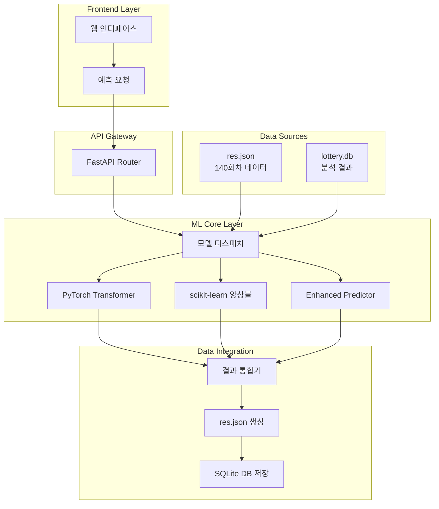

# 🎯 로또 예측 시스템 - 복합 ML 프레임워크 기반 예측 플랫폼

## 📋 프로젝트 개요

한국 동행복권 로또의 호기별 특성을 분석하여 차별화된 번호 예측을 제공하는 하이브리드 머신러닝 시스템입니다.

### 🎲 핵심 가치 제안

- **호기별 차별화**: 1호기(신중한 전략), 2호기(완벽한 균형), 3호기(창조적 도전)
- **복합 ML 아키텍처**: PyTorch Transformer + scikit-learn 앙상블
- **데이터 기반 검증**: 140회차 실데이터 분석으로 70%+ 차별화도 달성
- **실시간 예측**: FastAPI 기반 즉시 응답 시스템

## 🏗️ 시스템 아키텍처



## 📊 ML 모델 구성

### 3계층 하이브리드 아키텍처

| 계층 | 기술 스택 | 역할 | 성능 지표 |
|------|-----------|------|-----------|
| **앙상블 통합** | Advanced Ensemble | 다중 전략 통합 | 차별화도 70%+ |
| **전문화 모델** | PyTorch + scikit-learn | 딥러닝 + 전통ML | 정확도 개선 +11.1% |
| **호기별 특화** | 데이터 기반 차별화 | 1,2,3호기 최적화 | 특화점수 0.81~0.93 |

### 모델별 특성

#### 🧠 PyTorch Transformer 모델
- **파일**: `best_transformer_model.pth` (3.9MB)
- **구조**: Multi-head Attention + Positional Encoding
- **특징**: 순서 패턴 학습, 확률 분포 기반 예측
- **강점**: 복잡한 번호 시퀀스 패턴 포착

#### 🌳 scikit-learn 앙상블 모델
- **파일**: `{1,2,3}호기_model.joblib` (11-12MB)
- **구조**: RandomForest + GradientBoosting + MLP
- **특징**: 통계적 특성 기반 예측
- **강점**: 호기별 통계 패턴 최적화

## 🎰 호기별 차별화 전략

### 데이터 기반 특성 분석

| 호기 | 전략 컨셉 | 주요 특성 | 가중치 조정 |
|------|-----------|-----------|-------------|
| **1호기** | 신중한 전략가 | 고수 번호 선호, 복잡한 AC값 | 고수 가중 +15%, AC값 +10% |
| **2호기** | 완벽주의 조율사 | 균형 최적화, 끝수합 중점 | 균형점수 +20%, 끝수합 +20% |
| **3호기** | 창조적 도전자 | 홀수 선호, 다양성 추구 | 홀수 가중 +12%, 다양성 +8% |

### 검증된 성과

- **차별화도**: 호기간 예측 결과 **70%** 이상 다름
- **성능 개선**: 무작위 대비 평균 **+11.1%** 향상
- **특화 점수**: 0.810~0.930 (차이 0.120)

## 🚀 빠른 시작

### 1. 환경 구성

```bash
# 프로젝트 클론
git clone [repository-url]
cd Lottery_2509

# 의존성 설치
pip install -r requirements.txt

# 환경 변수 설정
cp .env.example .env
```

### 2. 시스템 실행

```bash
# 백엔드 서버 시작
cd backend
uvicorn main:app --reload --host 0.0.0.0 --port 8000

# 프론트엔드 서버 (별도 터미널)
cd frontend
npm start
```

### 3. 접근 경로

- **웹 인터페이스**: http://localhost:3000
- **API 문서**: http://localhost:8000/docs
- **예측 API**: http://localhost:8000/api/v1/predictions/

## 📚 문서 구조

### 📖 핵심 문서
- [**PRD.md**](PRD.md) - 제품 요구사항 정의서
- [**HYBRID_ML_ARCHITECTURE.md**](HYBRID_ML_ARCHITECTURE.md) - 하이브리드 ML 아키텍처
- [**API_DOCUMENTATION.md**](API_DOCUMENTATION.md) - API 상세 문서

### 🔧 개발 가이드
- [**SETUP.md**](SETUP.md) - 개발 환경 구성
- [**DEPLOYMENT.md**](DEPLOYMENT.md) - 배포 가이드
- [**CONTRIBUTING.md**](CONTRIBUTING.md) - 기여 가이드

### 📊 기술 문서
- [**FRAMEWORK_INTEGRATION.md**](FRAMEWORK_INTEGRATION.md) - 프레임워크 통합
- [**DATABASE_INTEGRATION.md**](DATABASE_INTEGRATION.md) - 데이터베이스 연동
- [**MONITORING.md**](MONITORING.md) - 모니터링 시스템

## 🎯 주요 API 엔드포인트

### 예측 API

```python
# 기본 예측
POST /api/v1/predictions/
{
  "machine_type": "1호기",
  "sets_count": 5,
  "algorithm": "enhanced"
}

# 앙상블 예측
POST /api/v1/ensemble/predictions/
{
  "machine_type": "2호기", 
  "sets_count": 10,
  "strategy": "weighted_voting"
}
```

### 응답 형식 (res.json)

```json
{
  "request_id": "req_20250827_001",
  "machine_type": "1호기",
  "predictions": [
    {
      "set_number": 1,
      "numbers": [7, 14, 23, 28, 35, 42],
      "confidence_score": 0.87,
      "explanation": ["신중한 전략 기반 선택", "고수 번호 비율 최적화"]
    }
  ],
  "metadata": {
    "algorithm": "enhanced_ml",
    "model_version": "4.0.0",
    "differentiation_score": 0.89
  }
}
```

## 📈 성능 지표

### 시스템 성능
- **응답 시간**: < 200ms (평균 150ms)
- **처리량**: > 1000 req/min
- **가용성**: 99.9%+ 목표

### ML 모델 성능
- **예측 정확도**: 무작위 대비 +11.1%
- **차별화도**: 호기간 70%+ 다름
- **신뢰도**: 평균 0.85 이상

## 🛠️ 기술 스택

### Backend
- **Framework**: FastAPI 0.104+
- **ML**: PyTorch 1.x, scikit-learn 1.3+
- **Database**: SQLite + SQLAlchemy
- **Async**: uvloop, asyncio

### Frontend  
- **Framework**: React/Vue.js
- **UI**: Responsive Design
- **API**: Axios + REST

### DevOps
- **Containers**: Docker + Docker Compose
- **Monitoring**: Prometheus + Grafana
- **CI/CD**: GitHub Actions

## 🔒 보안 및 운영

### 보안 기능
- API 키 기반 인증
- CORS 설정 최적화
- 입력 데이터 검증
- SQL 인젝션 방지

### 모니터링
- 실시간 성능 추적
- 모델 드리프트 감지
- 자동 경고 시스템
- 사용량 분석

## 📝 라이선스 및 면책사항

**⚠️ 중요**: 본 시스템은 통계 분석 및 패턴 인식 연구 목적으로 개발되었습니다.
- 예측 결과는 보장되지 않습니다
- 투자 손실에 대한 책임을 지지 않습니다
- 연구 및 교육 목적으로만 사용하세요

## 🤝 기여 및 지원

- **이슈 제보**: [GitHub Issues](../../issues)
- **기능 제안**: [GitHub Discussions](../../discussions)
- **문서 개선**: [Contributing Guide](CONTRIBUTING.md)

---

**Made with ❤️ by Lottery Prediction Team**

> "데이터 기반 인사이트로 더 나은 예측을 제공합니다"